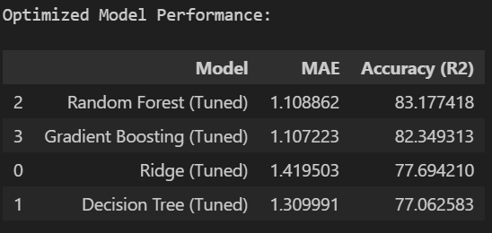
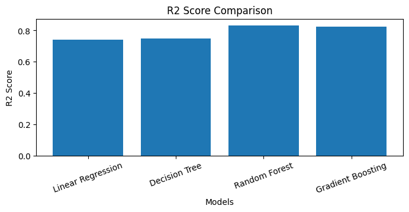
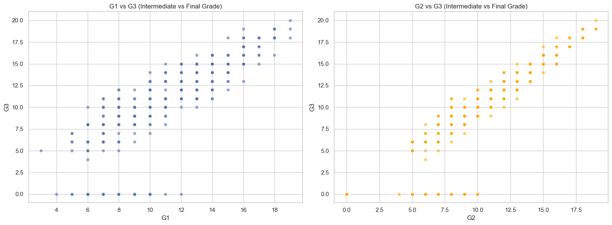
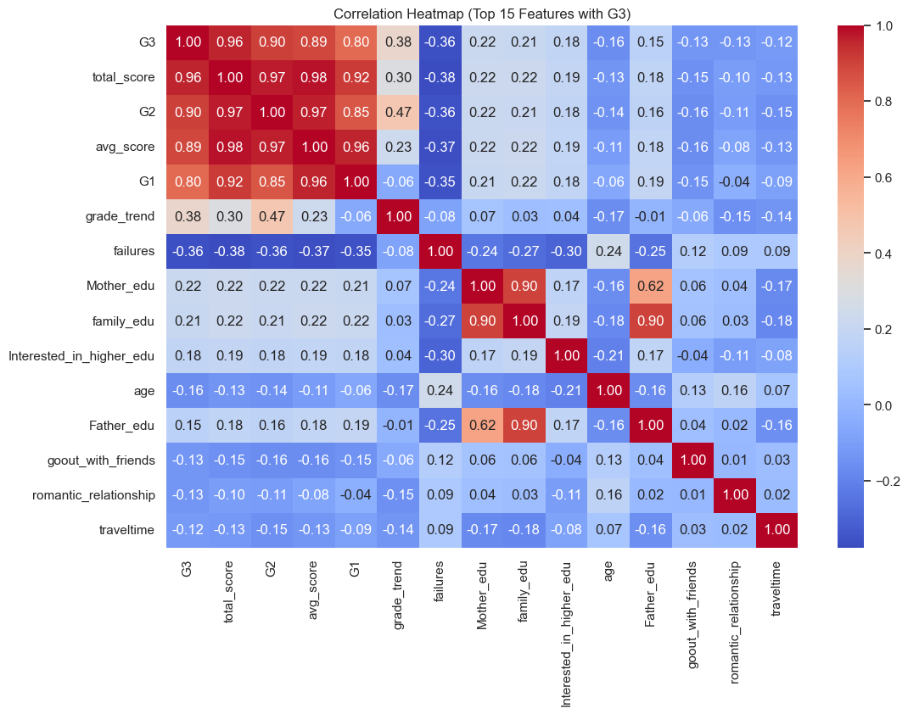
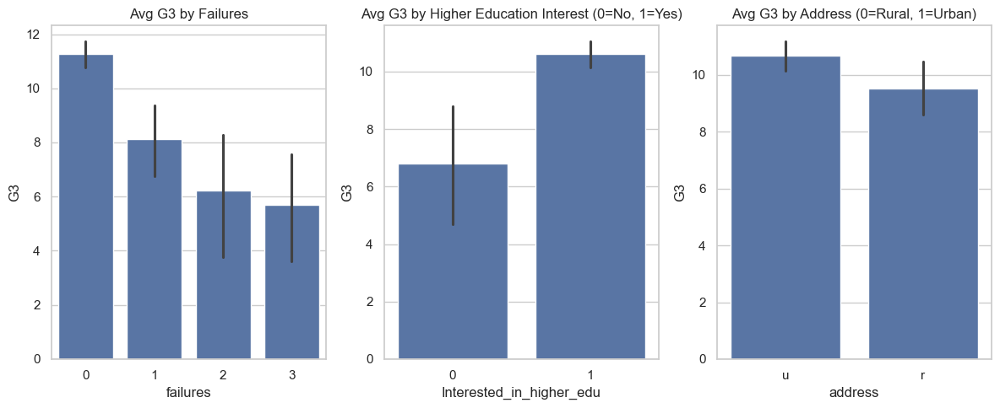
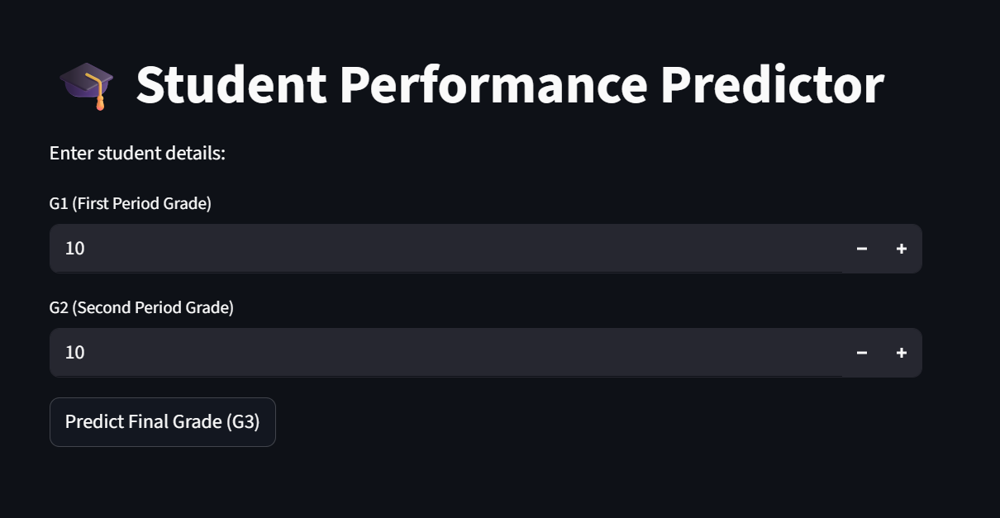
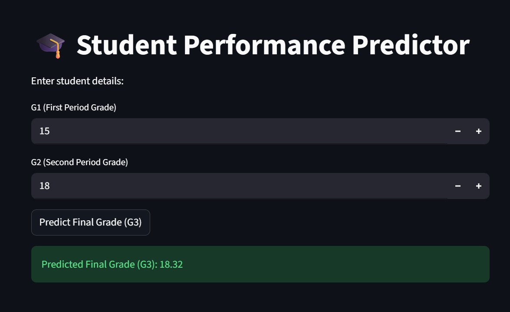

# Student Performance Predictor

A machine learning web application that predicts student performance based on various academic Grades. Built with Python, Streamlit, and scikit-learn.

# Flow
- Basic preprocessing
- Data Cleaning
- Feature Engineering
- Encoding Categorical values
- Exploratory Data Analysis
- Feature Selection
- Train Test Split
- Model Building
- Model Comparision
- Model Selection and dump
- streamlit webapp
- Deployment


## Features

- Interactive web interface for inputting student data
- Machine learning model for performance prediction
- Data visualization and analysis
- Model Accuracy 83%

## Project Structure

```
├── data/
│   ├── cleaned_student_data.csv
│   └── student-mat.csv
├── Models/
├── notebooks/
│   ├── models.ipynb
│   ├── preprocessing.ipynb
│   └── test.ipynb
├── Script/
│   └── app.py
├── requirements.txt
└── README.md
```

## Data

The project uses the Student Performance dataset from the UCI Machine Learning Repository. The data includes information about students' grades, study time, failures, and other factors.

## Model

The prediction model is trained using Random Forest algorithms. Model files are stored in the `Models/` directory.

##  Model Performance


###  Model Comparison


###  R2 Score


## EDA

###  G3 relation with G1 and G2


###  Heatmap


### Avg G3



## User Interface

### welcome page


### Output

